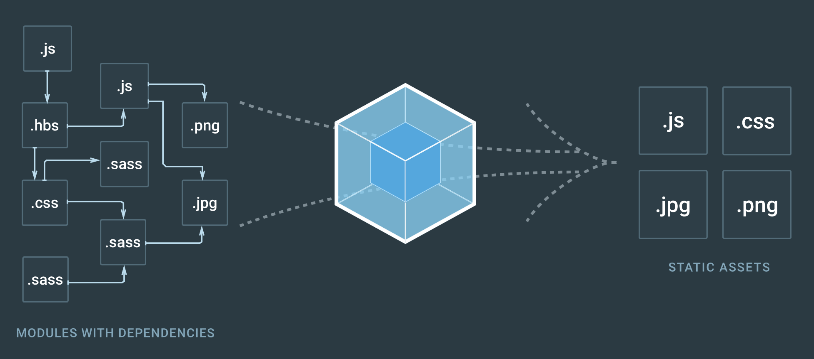
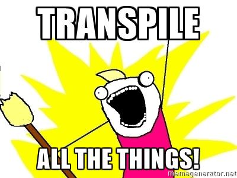

# <center>Formation Angular 2</center>


---

<center>

Formation professionnelle

Du 12 au 15 juin 2017

Rennes

</center>

---

# Qui suis-je ?

**Corentin Hatte**

* Consultant en développement Web & Mobile depuis 2011
* Spécialisé LoopBack (Node.js), Angular/Ionic (TypeScript) et Laravel (PHP)
* Formateur et enseignant depuis 2014

---

# Qui êtes-vous ?

Faisons un tour de table pour apprendre à vous connaître

* Votre nom ?
* Que faites-vous au quotidien ?
* Quelle est votre expérience avec Angular ?
* Qu'attendez-vous de cette formation ?

---

# Prérequis

* Maîtriser JavaScript (ES5)
* Maîtriser HTML et CSS
* Première expérience avec Node.js (installation de packages NPM)
* Ne pas avoir peur d'utiliser la CLI
* Première expérience souhaitée avec Angular 1

---

# Plan général


* Historique d'Angular 
  * Angular 1
  * Angular 2
  * Angular 4
* Rappels JavaScript & ES6
    * Syntaxe et nouveaux mots-clés
    * Templates literals
    * Approche modulaire
* Découverte de TypeScript
    * Installation et configuration
    * Utilisation

---


* Créer et configurer un projet Angular 2

    * Installer Angular CLI
    * Initialiser un projet
    * Configurer son projet
* Développer pour Angular 2 
  * Créer un module
  * Les composants
  * Mettre en place un routage
  * Injecter un service
  * Les observables
  * Exécuter des requêtes HTTP
  * Les templates (structures, pipes…)

---


* Passer en production
* Bonnes pratiques
    * Structurer son projet
    * Tests unitaires
    * Automatiser les tests
* Travailler à plusieurs

    * Les linters
    * Utiliser Git avec Angular 2

---

# Planning

| Matin        | Après-midi    |
| ------------ | ------------- |
| 9h00 — 12h30 | 14h00 — 17h30 |

Une pause intermédiaire est également prévue pour chaque période, n'hésitez pas à faire signe si vous en ressentez le besoin

---

# N'hésitez pas à poser des questions !

> **Il n'y a pas de question idiote, seulement une réponse idiote.**
> — Albert Einstein

---

# Angular, en bref

* Framework open-source (licence MIT)

  https://github.com/angular/angular.js

* Créé en 2010 (version 1)

* Pour créer des applications web dynamiques

* Balises et attributs HTML personnalisés

* Modulaire

* Facilement extensible

---

# What is Angular 2 ?

## Angular 2 is Angular 1 on steroids

Après un suspense de plus de 2 ans, Angular 2 est sorti de beta en septembre 2016.

Totalement réécrit, Angular 2 fait suite à Angular 1 avec une philosophie similaire mais une syntaxe différente.

---

Le langage par défaut est à présent **TypeScript**, un *superset* de **JavaScript**. Même s'il est possible de développer en JS pur, la documentation dédiée montre bien par sa pauvreté que ce n'est pas le langage conseillé.

Ces changements impliquent aussi qu'il faudra réécrire une partie de votre code *Angular 1* pour le rendre compatible *Angular 2*. Mais la compatibilité de TypeScript avec JavaScript vous permettra de migrer à votre rythme.

---

## Angular 4 is the new Angular 2

Tout juste 6 mois après la sortir d'Angular 2, la version 4 devient officielle.

Les principes de bases ne dévient pas de la version 2.

Il s'agit plus de changements internes et d'optimisations qu'autre chose.

---

### Mais… et Angular 3 dans tout ça ⁈

L'un des modules principaux d'Angular, le router, a évolué plus vite que prévu et est passé en version 4, causant une certaine confusion car son numéro de version majeure différait des autres modules d'Angular.

Les développeurs ont donc remédié à ce problème de façon pragmatique : en sautant un numéro de version majeure pour tout passer en version *4.x*.

Depuis mars 2017 nous avons donc le droit à Angular 4.

---

# <center>Avant toute chose… quelques rappels</center>


---

## ES6 / ES2015

* **ECMAScript 5** est officielle depuis **2009**.

  Il s'agit de la norme décrivant la syntaxe JavaScript que l'on connait depuis quelques années.

* **ECMAScript 6** est officielle depuis **2015**.

  Beaucoup de changements ont été apportés par cette version, qui est en cours d'intégration dans les navigateurs (voir https://kangax.github.io/compat-table/es6/)

* La **version 7** (ou 2016) est sortie en 2016.

---

## Les mots-clés `let` et `const` pour nommer les données

```javascript
// `var` limite la portée à la fonction, peu importe les blocs
for (var i=0; i<5; i++) {
  // …
}
console.dir(i); // 5

// `let` limite la portée au bloc
for (let i=0; i<5; i++) {
  // …
}
console.dir(i); // undefined
```

---

```
const foo = 'bar';
foo = 'test'; // TypeError: Assignment to constant variable
```

Pour des raisons de simplicité, nous utiliserons donc principalement `let` pour définir nos variables lors de cette formation, et `const` pour les constantes.

---

## Les templates literals

```javascript
let name = 'Toto';

const template = `<h1>Bonjour ${name}</h1>
	<p>Vous avez ${18 + 20} ans</p>`;

template; // '<h1>Bonjour Toto</h1>\n\t<p>Vous avez 38 ans</p>'
```

Les litéraux de gabarits ont trois principaux avantages :

1. On peut concaténer et interpoler très facilement ;
2. Les retours à la ligne ne posent plus de problème dans une même chaîne ;

---

3. On peut les étiqueter pour les traiter rapidement.

```javascript
let mineur = 18;
let majeur = 20;

function tag (strings, ...values) {
  console.log(strings[0]); // '<p>Vous avez '
  console.log(strings[1]); // ' ans</p>'
  console.log(values[0]);  // 38

  return 'Youpi !';
}

tag`<p>Vous avez ${ mineur + majeur } ans</p>`;
```

---

### Attention à la sécurité

Il ne faut pas laisser l'utilisateur manipuler les strings literals, même en partie, sans avoir échappé les données avant.

```javascript
`${console.warn('This is', this)}`; // window{} (not Sparta)
```

---

## Les *arrow functions*

Les fonctions fléchées permettent de définir une fonction de façon raccourcie, tout en évitant de lier certains mots-clés comme `this`, `super` ou `arguments`.

```javascript
let fn = (name, age = 40) => { // Assigner des valeurs par défaut aux arguments fonctionne aussi pour les fonctions fléchées
  return `<h1>Bonjour ${name}</h1>
	<p>Vous avez ${age} ans</p>`;
}
fn('Toto', 35);

let fn2 = name => `Bonjour ${name}`; // Lorsqu'il y a un seul argument, les parenthèses sont facultatives
fn2('Toto');
```

---

Cette syntaxe raccourcie permet de définir des fonctions anonymes très facilement.

```javascript
fetch('./data.json')
  .then(res => res.json())
  .then(console.table);

fetch('./data.json')
  .then(res => res.json())
  .then((data) => {
  	for (let row of data) {
      console.dir(row);
    }
  });
```

---

## Les modules ES6

ES6 permet de fonctionner avec une approche plus modulaire.

Cela permet par exemple de cloisonner chaque classe et valeur, sans définir de variables globales.

---

### Exporter un module

```javascript
export const name = 'Toto';
export var age = 35;

export default class Person {} // Export par défaut
```

L'export par défaut permet plus tard d'importer une valeur sans forcément connaître son nom.

---

### Importer un module

```javascript
import { name, age as ageDuCapitaine } from './test.module.js';
// Importer des valeurs membres d'un module en utilisant un alias si besoin

import Test from './test.module.js';
// Importer la valeur par défaut d'un module

import Test, { name } from './test.module.js';
// Importer la valeur par défaut et une valeur nommée
```

---

### Le support sur le terrain… une triste réalité

Node.js supporte (en partie) les modules avec une **syntaxe différente** depuis des débuts grace à Common.JS.

Peu de navigateurs (pour ne pas dire aucun) supportent les modules ES6 en production (mais ça arrive !).

Mais cela ne veut pas dire qu'il est impossible d'en utiliser pour autant !

---

### WebPack à la rescousse !

Note : il existe plusieurs module loaders sur le marché (Browserify, RequireJS…).

WebPack étant celui utilisé par défaut par Angular, il est important de comprendre son fonctionnement en priorité.

---



Source : https://webpack.js.org/

WebPack peut donc se charger de compiler tous vos fichiers, mais aussi de les regrouper en un seul.

---

WebPack s'utilise en créant un fichier `webpack.config.js` pour indiquer les fichiers sources ainsi que le fichier à exporter.

```javascript
module.exports = { // Syntaxe de module Node.js
  entry: './app.js',
  output: {
    filename: 'bundle.js'
  }
}
```

Le logiciel analysera de lui-même les fichiers à charger pour chaque module et les empaquetera.

Cela vous pemettra également de connaître directement les fichiers (JS, SASS, HTML, images…) dont les chemins sont incorrects.

---

# <center>TypeScript en quelques mots</center>


---

TypeScript est un **superset** de JavaScript. Cela signifie que votre code **JavaScript** existant est **compatible**.

Mais TS permet avant tout de combler certaines lacunes de JavaScript, comme l'absence d'approche objet ou le faible typage.

Mais ce langage n'est pas supporté tel quel par les navigateurs, il faudra donc le **transpiler**.

---

## Installer TypeScript

Une simple ligne de commande suffit à installer typescript, une fois que Node.js est disponible sur votre machine


```bash
npm install --global typescript # Ou `npm i -g typescript`
```

---

Ou bien, en démarrant Angular 2, tout est configuré localement pour votre projet

Aucune configuration supplémentaire n'est nécessaire, c'est prêt !

---

## Utiliser TypeScript dans votre éditeur de code favori

La plupart des éditeurs modernes permettent d'installer un plugin pour profiter de l'autocomplétion TypeScript, voire prennent en charge ce langage sans configuration nécessaire

---

### Atom


Il existe deux plugins majeurs pour l'éditeur Atom :

* **language-typescript-grammars-only** : permet de gérer simplement la coloration/validation syntaxique pour TS
* **atom-typescript** : comprend une barre de statut permanente avec plusieurs informations, gère — entre autres — le *compile on save*

---

### Sublime Text


En utilisant *Package Control*, vous pouvez installer le plugin **TypeScript** directement.

---

### Visual Studio Code


L'éditeur Visual Studio Code de Microsoft est livré avec le support intégral de TypeScript, sans besoin d'installer un plugin spécifique.

---

### Autres éditeurs

  

Il existe des plugins pour plusieurs autre éditeurs (Vim, Emacs, Eclipse, WebStorm…)

Il suffit de vous rendre sur le site [typescriptlang.org](https://www.typescriptlang.org/index.html#download-links) pour voir les liens vers les plugins pour les principaux éditeurs

---

## Transpiler un fichier



La ligne de commande permet de traduire facilement un fichier `.ts` en `.js` :

```bash
tsc fichier.ts
```

---

## Rédiger un fichier TypeScript

La syntaxe est très proche du JavaScript que vous connaissez… avec une véritable orientation objet et un typage (optionnel) en plus

---

```typescript
import { Observable } from 'rxjs/Observable';

class MonServiceTest extends Service {
  public getRandomNumber (
  	min: number = 0,
    max: number = 100
  ): Observable {
    return Observable.create((observer) => {
      setTimeout(() => {
        observer.next(this.getRandomNumberSync(min, max));
        observer.complete();
      }, 1000);
    });
  }
  
  private getRandomNumberSync (
  	min: number = 0,
    max: number = 100
  ): number {
    return Math.round(Math.random() * (max - min)) + min;
  }
}
```

---

## Les décorateurs

Les **décorateurs de class** sont appliqués au **constructeur** de la class. Ils peuvent être utilisés pour *observer*, *modifier* ou *remplacer* la définition d'une class.

---

```typescript
function classDecorator<T extends {
  new(...args:any[]):{}
}>(constructor:T) {
  return class extends constructor {
    newProperty = 'new property';
    hello = 'override';
  }
}

@classDecorator
class Greeter {
  property = 'property';
  hello: string;

  constructor(m: string) {
    this.hello = m;
  }
}

console.dir(new Greeter('world'));
```

---

Les **décorateurs de méthodes** ont un fonctionnement similaire, mais sont bien entendu liés… aux méthodes de class.

```typescript
class Greeter {
  greeting: string;
  constructor(message: string) {
    this.greeting = message;
  }

  @enumerable(false)
  greet() {
    return 'Hello, ' + this.greeting;
  }
}
```

---

```typescript
function enumerable(value: boolean) {
  return function (
    target: any,
    propertyKey: string,
    descriptor: PropertyDescriptor
  ) {
    descriptor.enumerable = value;
  };
}
```

---

### Concrètement… à quoi ça sert ?

Angular fournit un ensemble de décorateurs pour configurer facilement nos classes.

Cela permet d'éviter un héritage lourd et fastidieux, vous évitant ainsi d'appeler le constructeur parent avec un ensemble d'arguments.

La syntaxe fournit également une clarté lors de la lecture du code : le décorateur permet de voir la configuration d'une classe et son type avant même d'en voir le contenu

Note : Les décorateurs sont intégrés à la norme ES7, vous pourrez donc les utiliser en JS (*un jour*) !

---

# Créer et configurer un projet Angular 4

Maintenant que vous avez les idées fraiches en JavaScript et TypeScript, il va être temps de découvrir la nouvelle version d'Angular !

---

## Installer Angular CLI

L'outil en ligne de commande d'Angular s'installe via NPM.

On préférera l'installer globalement pour y accéder facilement.

```bash
npm install -g @angular/cli
```

Et voilà !

---

## Initialiser un projet

Pour créer un nouveau projet, il suffit d'utiliser l'outil *CLI* d'Angular en lui indiquant le nom à donner au dossier du projet (qui ne doit pas exister)

```bash
ng new my-app
```

On peut ensuite vérifier que notre application fonctionne :

```bash
ng serve --open
```

Un onglet de navigateur devrait s'ouvrir à l'adresse `http://localhost:8000`.

---

## La structure du projet

Vous devriez avoir une structure similaire à ceci dans votre dossier :

* **src/**
* **app/**
  * app.component.css
  * app.component.html
  * app.component.ts
  * app.component.spec.ts
  * app.module.ts
* **assets/**
* **environments/**
  * environment.prod.ts
  * environment.ts

---

* **src/** (*suite*)
  * index.html
  * mains.ts
  * polyfills.ts
  * test.ts
  * tsconfig.app.json
  * tsconfig.spec.json
  * typings.d.ts
* karma.conf.js
* package.json
* protractor.conf.js
* tsconfig.json
* tslint.json

---

# Développer pour Angular 2 

---

## Créer un module

Voici à quoi ressemble normalement le module racine de votre application (`src/app/app.module.ts`) :

---

```typescript
import { BrowserModule } from '@angular/platform-browser';
import { NgModule } from '@angular/core';
import { FormsModule } from '@angular/forms';
import { HttpModule } from '@angular/http';

import { AppComponent } from './app.component';

@NgModule({
  declarations: [
    AppComponent
  ],
  imports: [
    BrowserModule,
    FormsModule,
    HttpModule
  ],
  providers: [],
  bootstrap: [AppComponent]
})
export class AppModule { }
```

---

Les `declarations` servent à déclarer les composants présents dans le module.

L'attribut `import` sert à définir les modules à pré-charger pour l'ensemble de ce module.

Les `providers` sont les services à utiliser (pour l'instant il n'y en a pas).

L'attribut `bootstrap` indique le composant à démarrer au chargement du module.

---

### Utiliser le module racine

Pour initialiser le module racine, quelques lignes spécifiques sont nécessaires (`src/main.js`) :

```typescript
//On charge la plateforme
import { platformBrowserDynamic } 
	from '@angular/platform-browser-dynamic';

// On récupère notre module racine
import { AppModule } from './app/app.module';

// On compile et lance le module
platformBrowserDynamic().bootstrapModule(AppModule);
```

---

### Comparaison avec Angular 1

**Exercice** :

* Créer un module basique pour Angular 1
* Comparer les deux syntaxes

---

## Les composants

Un composant, dans sa forme la plus basique, ressemble aux lignes suivantes :

```typescript
import { Component } from '@angular/core';

@Component({
  selector: 'my-app',
  template: '<h1>{{title}}</h1>',
})
export class AppComponent {
  title = 'Minimal NgModule';
}
```

Votre fichier `src/app/app.component.ts` devrait d'ailleurs avoir une alure similaire

---

### Lier le composant à un module

Il suffit d'ajouter votre composant à la liste des `declarations` de votre module, comme vu lors de la création du module.

Pas besoin de configuration supplémentaire, Angular et WebPack se chargeront du reste !

---

### Comparaison avec Angular 1

**Exercice** : 

* Créer le controller équivalent avec Angular 1
* Comparer les deux syntaxes

---

## Mettre en place un routage

Avant de mettre en place un système de routage, il faut indiquer à Angular où se situe la racine de votre projet (chemin absolu) :

```html
<base href="/">
```

Cette ligne s'ajoute au début de la balise `<head>` de votre fichier `src/index.html`.

---

Pour configurer les routes d'un modules, il faut d'abord s'assurer que les dépendances nécessaires sont chargées (`src/app.app.module.ts`) :

```typescript
import { RouterModule, Routes } from '@angular/router';
```

---

On peut ensuite déclarer nos routes :

```typescript
const appRoutes: Routes = [
  { path: '/home', component: HomePageComponent },
  { path: '/user/profile', component: UserProfileComponent },
  {
    path: '',
    redirectTo: '/home',
    pathMatch: 'full'
  },
  { path: '**', component: PageNotFoundComponent }
];
```

---

Enfin, pour les utiliser, il faut ajouter un `import` à notre module :

```typescript
@NgModule({
  imports: [
    RouterModule.forRoot(appRoutes)
    // On n'oublie pas les autres imports…
  ],
  // … ni le reste des attributs de notre module
})
export class AppModule { }
```

Note : lorsque le module n'est pas le module racine, il faudra utiliser `RouterModule.forChild(moduleRoutes)`.

---

### Utiliser les routes

#### Avec du HTML

Pour que ces routes soient affichées quelque part, il faut indiquer à Angular où les injecter :

```html
<router-outlet></router-outlet>
```

Cette balise sera à placer à l'endroit de votre choix dans votre module.

---

On pourra également placer des liens pour utiliser nos routes :

```html
<h1>Angular Router</h1>
<nav>
  <a routerLink="/home" routerLinkActive="active">Accueil</a>
  <a routerLink="/user/profile" routerLinkActive="active">Mon profil</a>
</nav>
<router-outlet></router-outlet>
```

La class `active` sera donc appliquées aux liens actifs. Pratique pour leur donner un style spécifique !

**Note** : Les liens supportent également la syntaxe de changement de dossier (`./`, `../`, etc.).

---

#### Avec du TS

```typescript
constructor(
  private route: ActivatedRoute,
  private router: Router
) {}
```

```typescript
this.router.navigate(['logout'], {
  relativeTo: this.route
}); // Lien relatif

this.router.navigate(HomePageComponent); // Lien absolu
```

---

### Les routes imbriquées

Lorsqu'un ensemble de routes a une racine commune, il est possible de les rassembler :

---

```typescript
{
  path: '/user',
  component: UserComponent,
  children: [
    {
      path: 'profile',
      component: UserProfileComponent
    },
    {
      path: 'logout',
      component: UserLogoutComponent
    },
    {
      path: '',
      component: UserHomeComponent
    }
  ]
}
```

On peut également imbriquer les routes sur plusieurs niveaux, de la même manière.

---

### Les routes avec paramètres

Il est parfois utile d'avoir des adresses contenant des données variables (comme des IDs)

```typescript
{
  path: 'user/:id',
  component: UserDetailComponent
}
```

Pour y naviguer, il suffit d'indiquer le contenu de ce paramètre :

```typescript
this.router.navigate(['/user', user.id]);
```

---

Plutôt que d'analyser l'URL manuellement, laissons le Router se charger du travail :

```typescript
ngOnInit() {
  this.route.params
    // (+) converts string 'id' to a number
    .switchMap((params: Params) => this.service.getUser(+params['id']))
    .subscribe((user: User) => this.user = user);
}
```

Pour utiliser la méthode `ngOnInit` il faut implémenter la class `OnInit`

```typescript
import { Component, OnInit }  from '@angular/core';

@Component({
  // …
});
export class UserDetailComponent implements OnInit {
  // …
}
```

---

## Créer et injecter un service

Un service est une class unique (singleton) qui expose des méthodes publiques permettant généralement de traiter ou récupérer des données.

Il n'y a donc que très peu de configuration spécifique pour pouvoir l'utiliser.

---

```typescript
export class User {
  public name: string;
  public age: number;

  constructor(name: string, age: number) {
    this.name = name;
    this.age = age;
  }
}
```

```typescript
const USER: User = new User('Toto', 35);

export class UserService {
  getUser(): User {
    return USER;
  }
}
```

---

### Injecter le service

Avant de pouvoir l'injecter, il faut néanmoins le rendre injectable :

```typescript
import { Injectable } from '@angular/core';

@Injectable()
export class UserService {
  // …
}
```

---

Pour utiliser votre service, il suffit donc de le charger directement dans votre composant.

```typescript
@Component({
  providers: [ UserService ],
  // …
})
export class UserDetailComponent {
  public user: User;
  constructor(private userService: UserService) {
    this.user = this.userService.getUser();
  }
}
```

---

### Taking things slow…

Comme les services sont souvent amenés à effectuer des tâches lourdes ou longues, il faudra donc travailler de façon asynchrone.

Il y a alors 3 solutions :

* Utiliser des **callbacks**. *À l'ancienne*
* Utiliser des **Promises**. *Comme dans Angular 1*
* Utiliser des **Observables**. *Bienvenue dans le futur*

---

## Les observables

Très répandus dans les nouvelles versions d'Angular, les `Observable` sont très pratiques pour gérer des **changements d'état**.

À la différence d'une `Promise`, un `Observable` peut changer d'état **plusieurs fois**.

Vous pouvez également observer un même objet plusieurs fois, via des `subscribers`.

---

### Créer son propre `Observable`

```typescript
let age = new Observable();
age.next(35); // Signifier un changement d'état
setTimeout(() => {
  age.next(36); // Un nouveau changement d'état
  
  setTimeout(() => {
    age.complete(80); // L'observable est arrivé à son état final
  }, 44 * 365);
}, 365);
```

------

### Utiliser un `Observable`

```typescript
let age = getAgeOservable();
age.subscribe((val) => {
  console.info('Getting older!', val);
});
age.map((val) => {
  console.warn('Last state', val);
})
```

---

### Le cycle de vie des Observables

Comme vu, un Observable peut changer d'état plusieurs fois. Tant qu'il n'est pas arrivé à son état final, il est donc encore actif et peut être utile.

Une fois arrivé à son état final ou lors d'une erreur, néanmoins, sa vie arrive à sa fin. Il pourra alors être détruit.

---

## Exécuter des requêtes HTTP

Comme pour Angular 1, il faudra utiliser un service spécifique, qui se chargera des requêtes à notre place.

```typescript
import { Headers, Http } from '@angular/http';
```

---

### Les requêtes GET

Pour effectuer une requête GET, il suffit d'utiliser la méthode éponyme :

```typescript
this.http.get(url);
```

Cela vous donnera donc un Observable (transformable en `Promise` avec `.toPromise()` si besoin).

```typescript
this.http.get(url)
  .map(res => res.json().data as User);
```

---

### Les requêtes plus complexes

Les autres requêtes fonctionnent sur le même principe, aves des noms de méthodes explicites :

```typescript
this.http.post(
  '/users',
  JSON.stringify({
    name: 'James Bond',
    age: 35
  }),
  {
    headers: this.headers
  });
```

```typescript
this.http.delete(`/users/${id}`, {
  headers: this.headers
});
```

---

### Toujours gérer les erreurs

Comme les Promises, les Observables ont une méthode `catch` qui permet de gérer les erreurs

```typescript
this.http.get('/users')
  .map(this.extractData)
  .catch(this.handleError);
```

---

```typescript
private handleError (error: Response | any) {
  let errMsg: string;
  if (error instanceof Response) {
    const body = error.json() || '';
    const err = body.error || JSON.stringify(body);
    errMsg = `${error.status} - ${error.statusText || ''} ${err}`;
  } else {
    errMsg = error.message ? error.message : error.toString();
  }
  // On se contente de logger l'erreur pour l'instant
  console.error(errMsg);
  // Puis on relance l'erreur
  return Observable.throw(errMsg);
}
```

---

## Les templates (structures, pipes…)

Les templates dans Angular 2 & 4 n'ont plus la même structure que dans Angular 1.

Mais pas de panique, la logique reste néanmoins similaire !

Note : avec Angular nous ne touchons plus au DOM. Exit donc les librairies comme jQuery, tout se passe dans les templates !

---

### Afficher une variable

De ce côté-là, pas de changement majeur :

```html
<h1>{{ title | titlecase }}</h1>

<p>
  Bonjour {{ user.name }} !
</p>
```

---

### Structure conditionnelles `*ngIf`

```html
<div *ngIf="expression">
  Cette div n'apparaîtra dans le DOM
  que si l'expression est vraie
</div>
```

Le fonctionnement est plutôt simple : si l'expression contenue dans l'attribut `*ngIf` est fausse, l'élément n'est pas ajouté au DOM.

---

### Les boucles `*ngFor` 

#### La boucle `ngForOf`

Équivalent à un `for...of`, cette structure permet d'itérer sur les valeurs d'un tableau (ou un objet)

```typescript
public list: String[] = ['Hello', 'Bonjour', 'Hola', 'Ciao'];
```

```html
<li *ngFor="let item of list">{{ item }}</li>
```

---

#### La boucle `ngForIn`

Équivalent à un `for...in`, cette structure permet d'itérer sur les propriétés d'un objet

```typescript
public user: any = {
  name: 'Toto',
  age: 38,
  favoriteFramework: 'Angular',
  experience: Infinity
}
```

```html
<li *ngFor="let key in obj">
  <strong>{{ key }}</strong>
  => {{ obj[key] }}
</li>
```

------

### Les événements

Pour écouter un événement, il suffit d'indiquer son nom entre parenthèses :

```html
<button (click)="doSomething()">
  Cliquez ici !
</button>
```

Il faudra bien sûr penser à définir une méthode `doSomething` dans le controller !

Vous pouvez aussi utiliser des arguments :

```html
<button (click)="doSomething('uneValeur', uneVariable)">
  Cliquez ici !
</button>
```

------

### Lier un modèle à un champ de formulaire

Si vous voulez lier un champ de formulaire à une variable, il faut utiliser un `ngModel`, avec la syntaxe suivante :

```typescript
import { Component } from '@angular/core';

@Component({
  selector: 'my-app',
  template: `
    <input [(ngModel)]="name" #ctrl="ngModel" required>
    <p>Vous vous appelez {{ name }}</p>
    <p>Champ valide : {{ ctrl.valid ? 'oui' : 'non' }}</p>
    <button (click)="setValue()">Reset</button>
  `,
})
export class MonSuperController {
  name: string = '';
  setValue() {
    this.name = 'Toto';
  }
}
```

---

On peut également vérifier si le champ est valide grâce à la variable `ctrl` créée dynamiquement dans le template.

Vous liez ainsi vos variables à votre template dans les deux sens : s'il y a un changement d'un côté, il est répercuté de l'autre.

Vous pouvez ainsi gérer des formulaires entiers avec peu d'effort, Angular vous indiquera si le formulaire (ou chacun des champs) est valide.

Il suffit pour cela de nommer l'élément dont vous voulez vérifier la validité.

---

```html
<form #formulaire="ngForm" (ngSubmit)="onSubmit()">
  <input type="text"
         [(ngModel)]="user.name" #name="ngModel"
         required minlength="3" maxlength="20">
  <div *ngIf="name.errors">
    <div [hidden]="!name.errors.required">Name requis</div>
    <div [hidden]="!name.errors.minlength">Nom trop court</div>
    <div [hidden]="!name.errors.maxlength">Nom trop long</div>
  </div>
  
  <input type="email"
         [(ngModel)]="user.email" #email="ngModel"
         required>
  <div *ngIf="email.errors">Email invalide</div>
  
  <button type="submit" [disabled]="formulaire.errors">
    Valider
  </button>
</form>
```

------

### Travaux Pratiques

* Utiliser l'API de la STAR pour lister les lignes de bus de façon lisible
* Implémenter une barre de recherche pour trouver une ligne précise
* Permettre de voir les détails de chaque ligne sur une page différente
* Sur la page de détails, au clic sur un bouton, afficher les horaires temps réel de la ligne

------

# Travailler à plusieurs

Lorsque vous travaillez sur de gros projets, il faut souvent se répartir les tâches et travailler à plusieurs.

Mais pour éviter les prises de tête, mieux vaut prévenir et mettre en place les bons outils pour éviter les problèmes.

---

## Les linters

Dès la création du projet, un fichier `tslint.json` existe à la racine du projet.

Cela permet de vérifier facilement que les styles d'écriture sont cohérents et répondent à des règles pré-définies, via `tslint`

---

```bash
ng lint
```

Cette commande permet d'exécuter `tslint` directement depuis la version installée dans le projet, qui a été mise en place lors de sa création (il s'agit d'une dépendance listée dans le fichier `package.json`).

**Note** : Vous pouvez bien entendu utiliser un autre linter, mais il faudra l'intégrer au projet et s'assurer qu'il prenne en charge les fichiers TypeScript.

---

## Utiliser Git avec Angular

Lors de la création du projet, vous avez sans doute remarqué la ligne `Successfully initialized git`.

Cela signifie qu'un fichier `.gitignore` a été mis en place, pour faciliter la mise en place d'un versioning de vos fichiers.

---

Vous pouvez donc rapidement initialiser votre repo Git avec `git init` et le lier à votre repo distant (en adaptant évidemment le nom de votre *remote* et l'URL du repo).

```bash
git remote add origin https://github.com/pseudo/repo.git
```

------

# Passer en production

Si votre projet est bien structuré, vous ne devriez pas avoir trop de mal à passer en production.

La commande `ng build` générera les fichiers qu'il faut exposer au client.

---

Si votre application est routée, il faudra par contre s'assurer que toutes les URL mènent au fichier `index.html` à la racine par votre serveur : c'est votre application qui se chargera de diriger l'utilisateur vers le bon module/composant.

Si votre serveur est compatible *HTTP/2*, il n'est pas utile de regrouper les fichiers compilés : mieux vaut les laisser séparés pour permettre au client de ne charger que ceux qui lui sont utiles en réutilisant une même socket.

---

# Bonnes pratiques

En tant que développeurs expérimentés, je vous fais confiance pour coder proprement.

Mais quelques rappels ne font jamais de mal… :-) 

---

## Structurer son projet

Comme vous l'avez vu, les projets sont déjà structurés. Mais cela n'empêche pas de revoir quelques bonnes habitudes à prendre.

* Séparer chaque module dans un dossier différent
* Regrouper tous les fichiers (TS, HTML, CSS, SASS…) d'un même module dans un même dossier parent
  Les sous-dossiers sont bien sûr autorisés, pour plus de clarté
* Exposez vos composants et services principaux via un fichier commun pour tout le module si vous avez besoin de les utiliser dans d'autres modules

---

## Tests unitaires

Mettre en place une série de tests unitaires est indispensable pour s'assurer que votre code répond au besoin et qu'aucune régression n'aura lieu dans le futur.

Angular intègre de base une librairie de tests (Karma), ainsi que quelques exemples pour vous aider.

Le fichier `src/test.ts` sert à configurer et lancer les tests pour Angular.

---

Vous trouverez un exemple de test dans `src/app/app.component.ts`. N'hésitez pas à vous en inspirer pour fournir des tests pour l'ensemble de vos composants et services.

Pour lancer ces tests, la commande `ng test` se chargera de tout.

---

## Automatiser les tests


Mettre des tests en place vous sauvera probablement de nombreuses heures de debug. Mais pour être encore plus efficace, il ne faut pas hésiter à les automatiser.

D'autant que cela vous assurera que les tests passent pour tout le monde avant de publier votre application.

---

#### Via le déploiement continu

Si vous avec un outil de déploiement continu, il peut être intéressant de le configurer pour lancer vos tests automatiquement. Cela permet de ne pas avoir à le faire manuellement, tout en permettant à d'autres (chef de projet, collègues…) de voir les erreurs que chacun fait pour progresser également.

---

#### Via un *hook* Git

Vous pouvez configurer votre repo Git pour exécuter les tests avant chaque *push*.

En créant un fichier dans le répertoire `.git/hooks/pre-commit` vos tests seront lancés en local avant chaque commit, par exemple.

---

# Acronymes et abréviations

[^ES]: ECMAScript, nom de la norme sur laquelle se base JavaScript pour sa syntaxe
[^TS]: TypeScript, un superset de JavaScript


